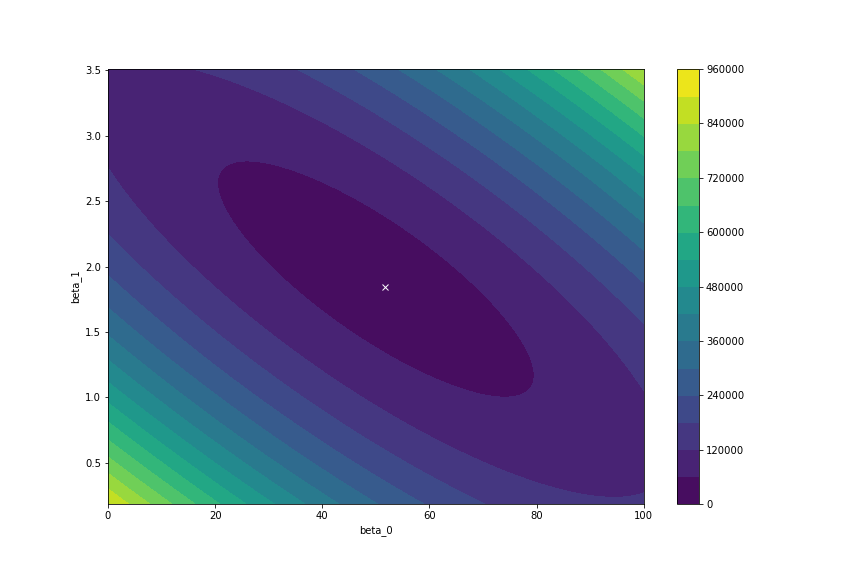
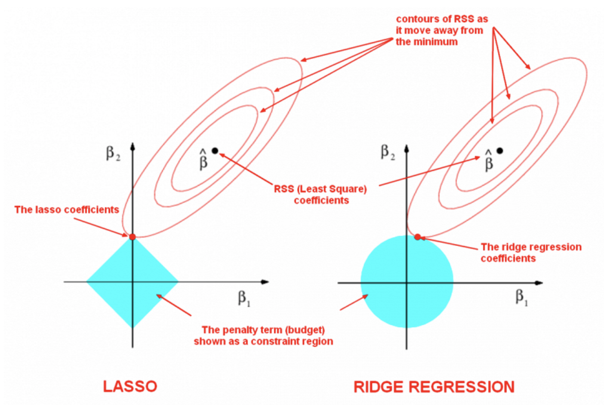

build-lists: true
slidenumbers: true
footer:  J. Pounders, DSI-EAST-1

# [fit]   Regularization

### Justin Pounders

---

# Objectives

- Define and describe regularization for regression models
- Write the regularized loss function
- Describe how regularization affects regression coefficients
- Describe the differences between the Lasso, Ridge, and ElasticNet models
- Implement and visualize the penalties using `sklearn`

---

# [fit] Warmup

**With a partner, describe what overfitting is and how it occurs.  What is the impact of overfitting?**

---

# Overfitting

> *Overfitting* means building a model that matches the training data "too closely." The model ends up training on noise rather than signal.

- Usually cause by model that is *too complex*
- Overfit model *does not generalize*
- Low bias/high variance models

---

---

# Do I need to worry about overfitting with *Linear Regression*?

**"Good" properties**

- Low complexity
- High bias/low variance
- Does not tend to overfit

---

# Do I need to worry about overfitting with *Linear Regression*?

**Danger zone**

- Including irrelevant features (signal v noise)
- $$p$$ (number of features) is close to $$n$$ (number of observations)
- Correlated inputs
- Numerically large coefficients

---

---

# Error and the Loss Function

$$
\begin{align}
RSS(\beta_0, \beta_1) &= \sum_{i=1}^n \left( \hat{y}_i - y_i \right)^2 \\
    &= \sum_{i=1}^n \left( \hat{y}_i - \beta_0 - \beta_1 x_i \right)^2
\end{align}
$$

The goal of training is to minimize $$RSS(\beta_0, \beta_1)$$, i.e. 

$$
\beta_0, \beta_1 = \arg\min RSS(\beta_0, \beta_1)
$$

---

---

# Ridge Regression

## (a.k.a. Tikhonov regularization, weight decay, $$L_2$$ regularization)

$$
J(\beta_0, \beta_1) = RSS(\beta_0, \beta_1) + \alpha \beta_1^2
$$

> Ridge regression *penalizes* the model for having large coefficients.  As $$\alpha$$ increases, $$\beta_1$$ will decay.

**$$\alpha$$ acts as a "tuning" parameter.**

---

# Ridge Regression (general case)

$$
J(\beta_0, \beta_1, ..., \beta_p) = RSS(\beta_0, \beta_1, ..., \beta_p) + \alpha \sum_{i=1}^p \beta_i^2
$$

> Ridge *shrinks* the regression coefficients.

---

# Ridge Regression
## Get ready to roll (down the loss function!)

**Check**: Find the `sklearn` documentation on Ridge Regression.  Locate the *model description* (inputs, outputs, parameters, methods), and the *discussion of the theory* with examples.

1. How do you set the regularization strength?
2. How can you get the values of the regularized regression coefficients?

---

# Lasso Regression

## a.k.a. $$L_1$$ regularization

$$
J(\beta_0, \beta_1) = RSS(\beta_0, \beta_1) + \alpha \left| \beta_1 \right|
$$

> Lasso regression *penalizes* the model for having large coefficients.  As $$\alpha$$ increases, $$\beta_1$$ will decrease, even to the point of zero.

**$$\alpha$$ acts as a "tuning" parameter.**

---

# Lasso Regression (general case)

$$
J(\beta_0, \beta_1, ..., \beta_p) = RSS(\beta_0, \beta_1, ..., \beta_p) + \alpha \sum_{i=1}^p \left| \beta_i \right|
$$

> Ridge *shrinks* the regression coefficients, and may "zero-out" unimportant features.

---

---

# Tuning Bias vs Variance with Regularization

*Alert!!* Key takeaway!

- Increase $$\alpha$$ (turn **up** regularization)
  - Increase bias
  - Decrease variance
- Decrease $$\alpha$$ (turn **down** regularization)
  - Decrease bias
  - Increase variance

---

# Additional Considerations

- Features (inputs) should be *standardized* in regularized models
  - Why?
- Ridge vs Lasso?
  - Maybe have irrelevant features? **Lasso**
  - Just want the best prediction? **Try both**
  - Want to use both? **ElasticNet**

---

# Elastic Net Regression

$$
J(\beta_0, \beta_1) = RSS(\beta_0, \beta_1) + \alpha_1 \left| \beta_1 \right| + \alpha_2 \beta_1^2
$$

> *Elastic net* combines Ridge and Lasso penalties

**$$\alpha_1$$ and $$\alpha_2$$ both act as "tuning" parameters**

---

# Elastic Net Regression
## A second (equivalent formulation) used by `sklearn`

$$
J(\beta_0, \beta_1) = RSS(\beta_0, \beta_1) + \alpha\rho \left| \beta_1 \right| + \frac{\alpha(1-\rho)}{2} \beta_1^2
$$

> *Elastic net* combines Ridge and Lasso penalties

- $$\alpha = $$ penalty strength
- $$\rho = $$ Lasso ($$L_1$$) ratio

---

# Elastic Net Regression
## A second (equivalent formulation) used by `sklearn`

$$
J(\beta_0, \beta_1) = RSS(\beta_0, \beta_1) + \alpha\rho \left| \beta_1 \right| + \frac{\alpha(1-\rho)}{2} \beta_1^2
$$

> *Elastic net* combines Ridge and Lasso penalties

**Check**: what values of $$\rho$$ lead to (a) Ridge and (b) Lasso regression?

---

# Elastic Net Regression (general case)

$$
J(\beta_0, \beta_1, ..., \beta_p) = RSS(\beta_0, \beta_1, ..., \beta_p) + \alpha\rho \sum_{i=1}^p \left| \beta_i \right| + \frac{\alpha(1-\rho)}{2} \sum_{i=1}^p \beta_i^2
$$

---

> [Elastic Net] allows for learning a sparse model where few of the weights are non-zero like Lasso, while still maintaining the regularization properties of Ridge.
-- `sklearn` docs

---

# Turn and Talk

With a partner, discuss and summarize...
1. What is Ridge regularization?
2. What is Lasso regularization?
3. What is Elastic Net regularization?

After 4 minutes, I will call on volunteers to summarize one of these responses.

---

# [fit] Python Time
